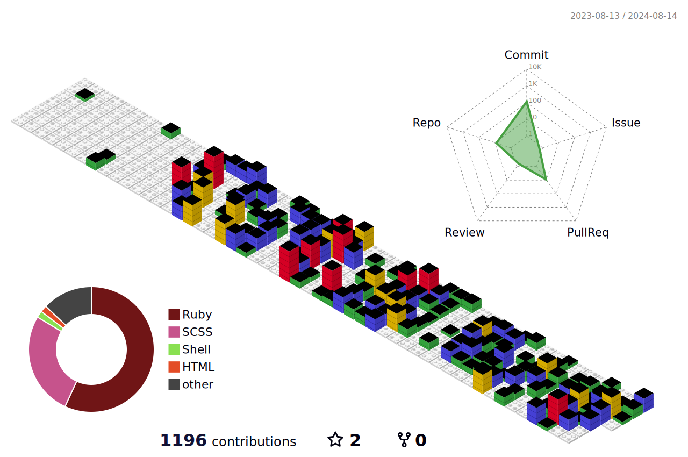

### Hi there 👋

My name is [Alex Massaad](https://www.massaad.ca/) and I'm a Software Engineer, Former Magician and all around curious human.

- 🔭 I’m currently working on:
  - An [app to save podcasts](https://github.com/amassaad/podcast_vault) and their metadata (and soon, media too): 
  - Using [Ruby and the OpenAI API](https://github.com/amassaad/honey-ai-shrunk-the-kids) to summarize text automatically: 
  - A project to print GitHub Issues to paper using a receipt printer. This is to avoid switching tabs when coding.
- 🌱 I’m currently learning:
  - [Chat GPT and the OpenAI API](https://github.com/amassaad/honey-ai-shrunk-the-kids)
  - Refreshing my JS and React knowledge: https://www.theodinproject.com/
  - The Shopify API, by building a private app
  - The ECSPOS library to print on thermal receipt printers

<!--
**amassaad/amassaad** is a ✨ _special_ ✨ repository because its `README.md` (this file) appears on your GitHub profile.

Here are some ideas to get you started:

- 🔭 I’m currently working on ...
- 🌱 I’m currently learning ...
- 👯 I’m looking to collaborate on ...
- 🤔 I’m looking for help with ...
- 💬 Ask me about ...
- 📫 How to reach me: ...
- 😄 Pronouns: ...
- ⚡ Fun fact: ...
-->
